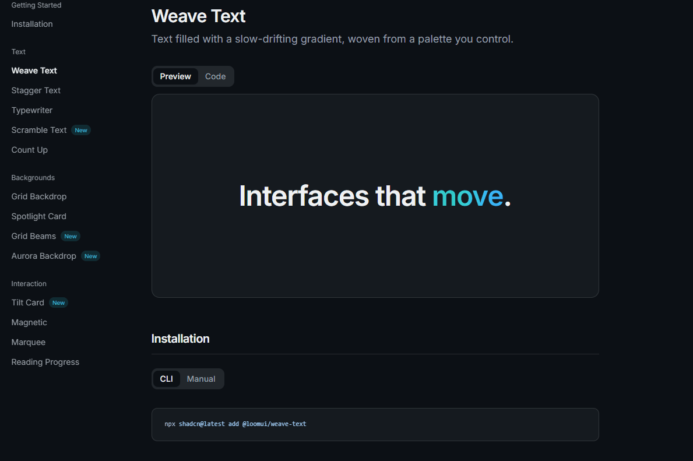

<div align="center">

# Loom UI

**Open-source animated components for React.**
Weave motion into your interface, one file at a time.

[Documentation](https://loomui.design) · [Components](https://loomui.design/docs/components) · [Contributing](CONTRIBUTING.md)

[](LICENSE.md)
[](https://github.com/rjcuff/Loom-UI/stargazers)
[](https://ui.shadcn.com/docs/registry)



</div>

## Install

Components are copied into your project rather than installed as a dependency,
distributed through a [shadcn](https://ui.shadcn.com/docs/registry)-compatible
registry:

```bash
npx shadcn@latest add @loomui/weave-text
```

You own the file from that moment on. Edit it, delete it, rename it. Nothing
upstream breaks.

Every component below installs the same way. Swap `weave-text` for its name.

## Components

30 components, no runtime dependency on this project.

### Text

| Component                                                              | What it does                                                                                     |
| ---------------------------------------------------------------------- | ------------------------------------------------------------------------------------------------ |
| [`weave-text`](https://loomui.design/docs/components/weave-text)       | Text filled with a slow-drifting gradient, woven from a palette you control.                     |
| [`stagger-text`](https://loomui.design/docs/components/stagger-text)   | Words or characters that rise into place one after another, on mount or on scroll.               |
| [`typewriter`](https://loomui.design/docs/components/typewriter)       | Phrases typed out and deleted in a loop, with a caret and no layout shift.                       |
| [`scramble-text`](https://loomui.design/docs/components/scramble-text) | A string that resolves out of random glyphs, left to right, on mount, on scroll, or on hover.    |
| [`count-up`](https://loomui.design/docs/components/count-up)           | A number that counts to its value when it scrolls into view, without a render per frame.         |
| [`lens-text`](https://loomui.design/docs/components/lens-text)         | Text held out of focus until the pointer passes over it like a magnifying glass.                 |
| [`split-flap`](https://loomui.design/docs/components/split-flap)       | A departure board that flaps through its glyphs, one cell behind the last, until it lands.       |

### Backgrounds

| Component                                                                  | What it does                                                                        |
| --------------------------------------------------------------------------- | ------------------------------------------------------------------------------------ |
| [`grid-backdrop`](https://loomui.design/docs/components/grid-backdrop)     | An SVG grid with cells that fade in and out at a deterministic, seeded scatter.      |
| [`spotlight-card`](https://loomui.design/docs/components/spotlight-card)   | A surface with a soft highlight that follows the pointer and fades out on leave.     |
| [`grid-beams`](https://loomui.design/docs/components/grid-beams)           | A ruled grid with neon beams running down random lines, fading out toward the edges. |
| [`aurora-backdrop`](https://loomui.design/docs/components/aurora-backdrop) | A wash of blurred colour that drifts behind content on cycles that never line up.    |
| [`stitch-path`](https://loomui.design/docs/components/stitch-path)         | A running stitch sewn along an SVG path as the page scrolls, following its holes.    |

### Buttons

| Component                                                                  | What it does                                                                             |
| --------------------------------------------------------------------------- | ------------------------------------------------------------------------------------------ |
| [`hold-button`](https://loomui.design/docs/components/hold-button)         | A button that fires only after a deliberate press and hold, with a fill counting it out.  |
| [`ripple-button`](https://loomui.design/docs/components/ripple-button)     | A circle sent out from wherever the button was pressed, sized to reach the furthest corner. |
| [`confetti-button`](https://loomui.design/docs/components/confetti-button) | A handful of paper thrown into the air on press, each piece lobbed on its own arc.        |

### Interaction

| Component                                                                      | What it does                                                                             |
| ------------------------------------------------------------------------------- | ------------------------------------------------------------------------------------------ |
| [`tilt-card`](https://loomui.design/docs/components/tilt-card)                 | A surface that leans away from the pointer in 3D and settles back on leave.               |
| [`flip-card`](https://loomui.design/docs/components/flip-card)                 | A card with two faces that turns in 3D when it is clicked, controlled or on its own.      |
| [`compare-slider`](https://loomui.design/docs/components/compare-slider)       | Two versions of the same frame, split by a divider you drag, or move with the arrow keys. |
| [`sticker-peel`](https://loomui.design/docs/components/sticker-peel)           | A card whose corner lifts off the page on hover, folded back to show its backing.         |
| [`elastic-tabs`](https://loomui.design/docs/components/elastic-tabs)           | A tab group whose pill stretches to cover both tabs before it contracts onto your pick.   |
| [`ticket-stub`](https://loomui.design/docs/components/ticket-stub)             | A card torn along a perforation, with a notch bitten out of the paper at each end of it.  |
| [`magnetic`](https://loomui.design/docs/components/magnetic)                   | A wrapper that pulls its child toward the pointer as the pointer gets close.              |
| [`marquee`](https://loomui.design/docs/components/marquee)                     | A seamless scrolling row or column, in either direction, that pauses on hover.            |
| [`reading-progress`](https://loomui.design/docs/components/reading-progress)   | A pinned bar that tracks how far through the page, or a chosen element, the reader is.    |

### Sections

| Component                                                                        | What it does                                                                            |
| ---------------------------------------------------------------------------------- | ----------------------------------------------------------------------------------------- |
| [`testimonial-wall`](https://loomui.design/docs/components/testimonial-wall)     | Columns of quotes drifting past each other at different speeds, faded at both ends.      |
| [`thread-timeline`](https://loomui.design/docs/components/thread-timeline)       | A timeline whose thread is sewn down the page as you read, lighting each node it reaches. |
| [`logo-loom`](https://loomui.design/docs/components/logo-loom)                   | A logo row woven into place, every other mark arriving from the other side of the thread. |

### Mockups

| Component                                                    | What it does                                                                                 |
| -------------------------------------------------------------- | ---------------------------------------------------------------------------------------------- |
| [`iphone`](https://loomui.design/docs/components/iphone)     | A device frame drawn from the real measurements, with a screen you put anything in.           |
| [`ipad`](https://loomui.design/docs/components/ipad)         | A tablet frame drawn from the real measurements, upright or on its side.                      |
| [`macbook`](https://loomui.design/docs/components/macbook)   | A laptop frame with the camera housing cut into the display and the scoop cut into its base.   |

## Works with your coding agent

The registry publishes [`llms.txt`](https://loomui.design/llms.txt) and
[`llms-full.txt`](https://loomui.design/llms-full.txt), so Claude Code, Cursor,
and v0 can read the whole catalogue and install from it directly:

```
Add the split-flap component from https://loomui.design/llms.txt
```

## Local development

Requires Node 22.14+ and pnpm 9+.

```bash
pnpm install
pnpm build:registry   # generate __index__.tsx, registry.json, public/r/*.json
pnpm dev              # http://localhost:3000
```

### Repository layout

```
.
├── apps/www                  # docs site (Next.js 15, App Router, fumadocs MDX)
│   ├── app/                  # routes: (marketing) and (docs)
│   ├── content/docs/         # MDX docs, one file per component
│   ├── components/           # docs site chrome (not shipped to users)
│   ├── registry/
│   │   ├── loomui/           # the components users install
│   │   ├── example/          # demos rendered in the docs
│   │   ├── lib/              # shared helpers shipped with components
│   │   ├── registry-*.ts     # hand-written manifests
│   │   ├── index.ts          # merged + schema-validated registry
│   │   └── __index__.tsx     # GENERATED lazy component map
│   ├── scripts/              # registry build + dependency sync
│   └── public/r/             # GENERATED per-component JSON
└── turbo.json                # task graph
```

### Scripts

| Command                    | Does                                               |
| -------------------------- | -------------------------------------------------- |
| `pnpm dev`                 | Run the docs site                                  |
| `pnpm build`               | Build the registry, then the site                  |
| `pnpm build:registry`      | Regenerate every registry artifact                 |
| `pnpm registry-deps:check` | Fail if example imports and manifest deps disagree |
| `pnpm registry-deps:fix`   | Rewrite manifest deps from example imports         |
| `pnpm typecheck`           | `tsc --noEmit`                                     |
| `pnpm format:check`        | Prettier                                           |
| `pnpm check`               | Typecheck, format check, and registry deps check   |

## Adding a component

1. Write `apps/www/registry/loomui/<name>.tsx`. Named export, no default.
2. Write a demo at `apps/www/registry/example/<name>-demo.tsx` with a default
   export.
3. Add entries to `registry-ui.ts` and `registry-examples.ts`. Declare npm
   packages under `dependencies`, other registry items under
   `registryDependencies`, and any keyframes under `cssVars` / `css`.
4. Write `apps/www/content/docs/components/<name>.mdx`.
5. Add the page to `apps/www/config/docs.ts` so it appears in the sidebar.
6. Run `pnpm build:registry` and commit the generated files.

> Names are load-bearing: the component file, the docs slug, the demo, and the
> manifest entry all share one kebab-case name.

### Generated files

These are committed and checked for drift in CI. **Never edit them by hand.**

- `apps/www/registry/__index__.tsx`
- `apps/www/registry.json`
- `apps/www/public/registry.json`
- `apps/www/public/r/*.json`
- `apps/www/public/llms.txt`, `apps/www/public/llms-full.txt`

## Contributing

Issues and pull requests are welcome. See [CONTRIBUTING.md](CONTRIBUTING.md).
If Loom UI is useful to you, a star helps other people find it.

## License

[MIT](LICENSE.md)
